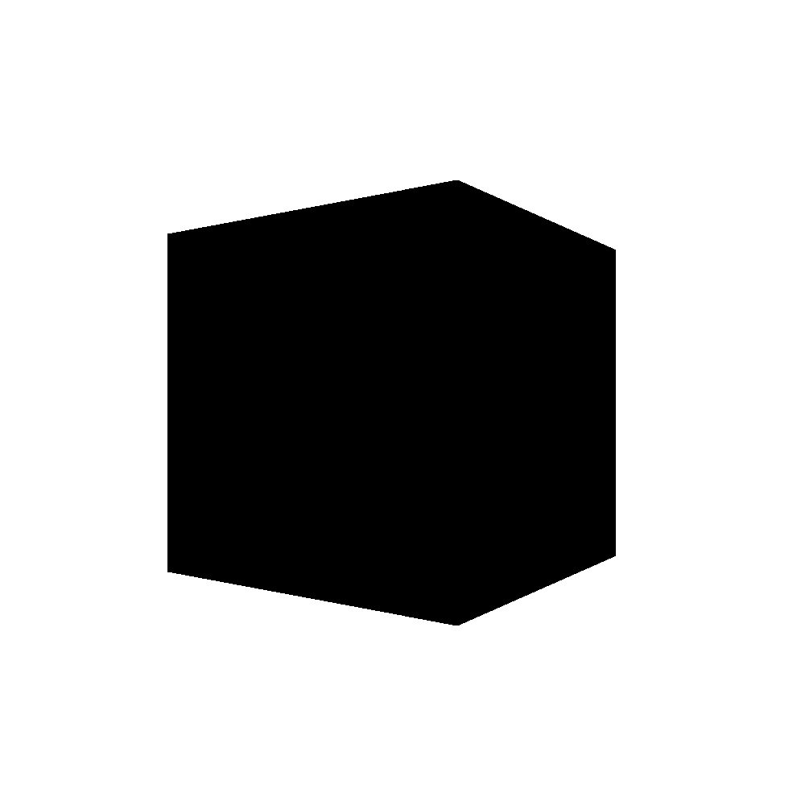

# Simple C++ Rasterizer ⬛️⬜️

This is a WIP repository meant to keep track of the changes made to the rasterizer I am making for my computer graphics course.

All we got is lines at the moment. More to come soon!
